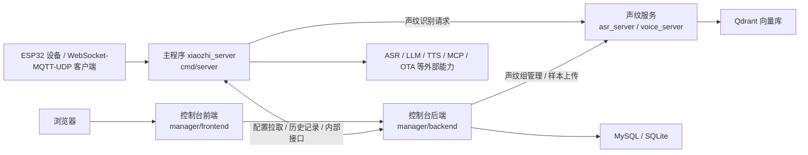

# 编译与部署指南

本文面向需要从源码编译、调试和部署本项目的开发者，整理主程序、控制台前后端、声纹服务的编译与部署方式。

建议按下面的阅读顺序使用本文：

- 先看整体架构，明确每个服务的位置和调用关系
- 再按“主程序 -> 控制台后端 -> 控制台前端 -> 声纹服务”的顺序分别完成编译与部署
- 最后如果需要制作一体化发布包，再看文末的 AIO 打包流程

本文优先介绍每个服务分别编译、分别部署的方式；AIO 形态放在后面单独说明。

## 1. 服务拆分说明

日常开发、联调、单独替换某个服务时，建议使用分离部署形态：

- 主程序：`cmd/server`
- 控制台后端：`manager/backend`
- 控制台前端：`manager/frontend`
- 声纹服务：`asr_server` 子模块

这四部分分别编译、分别启动，最适合开发调试。

一体化的 AIO 打包方式放在本文后半部分，适合做发布包或交付包。

## 2. 整体架构



### 2.1 各服务在架构中的位置

| 服务 | 代码目录 | 主要职责 | 常见端口 |
| --- | --- | --- | --- |
| 主程序 | `cmd/server` | 设备接入、会话编排、ASR/LLM/TTS 调度、OTA、WebSocket/MQTT/UDP | `8989` / `2883` / `8990` |
| 控制台后端 | `manager/backend` | 管理 API、配置管理、历史记录、声纹组管理 | `8080` |
| 控制台前端 | `manager/frontend` | 管理页面、配置向导、测试工具 | 开发态 `3000` |
| 声纹服务 | `asr_server` | 声纹注册、识别、验证、流式接口 | 源码默认 `9000` |

### 2.2 关键地址对齐关系

分离部署时，下面四个地址一定要对齐：

| 调用方向 | 配置项 | 典型值 |
| --- | --- | --- |
| 前端 -> 后端 | `VITE_API_TARGET` | `http://127.0.0.1:8080` |
| 主程序 -> 控制台后端 | `config/config.yaml` -> `manager.backend_url` | `http://127.0.0.1:8080` |
| 控制台后端 -> 声纹服务 | `manager/backend/config/config.json` -> `speaker_service.url` 或 `SPEAKER_SERVICE_URL` | `http://127.0.0.1:9000` |
| 主程序 -> 声纹服务 | `config/config.yaml` -> `voice_identify.base_url` | `http://127.0.0.1:9000` |

## 3. 环境准备

### 3.1 拉取代码与子模块

声纹服务是 Git 子模块，首次拉取后请执行：

```bash
git submodule update --init --recursive
```

如果你是新克隆仓库，推荐直接：

```bash
git clone --recursive <repo-url>
```

### 3.2 推荐工具版本

- Go：`1.24.x`，与 CI 中的 `1.24.4` 保持一致
- Node.js：`20.x`
- npm：跟随 Node 20

### 3.3 Linux 本地编译公共依赖

主程序和声纹服务都涉及 CGO、ONNX Runtime 或 ten-vad 动态库，Ubuntu 可参考：

```bash
sudo apt-get update
sudo apt-get install -y pkg-config libopus0 libopusfile-dev libc++1 libc++abi1
```

主程序本地源码编译还需要安装 ONNX Runtime 1.21.0，步骤可直接参考根目录 `README.md` 中“本地编译”章节。

### 3.4 建议先准备的基础设施

- MySQL：控制台后端使用 MySQL 时需要
- Qdrant：声纹服务使用 `qdrant` 存储时需要

如果只是本地功能验证：

- 控制台后端可先用 SQLite
- 声纹服务可先用 JSON 存储

## 4. 分离部署：各服务编译与部署

### 4.1 主程序

代码目录：`cmd/server`

### 关键配置

配置文件默认位置：

```text
config/config.yaml
```

源码部署时最常改的是：

- `manager.backend_url`
- `websocket.host` / `websocket.port`
- `mqtt_server.listen_port`
- `udp.listen_port`
- `voice_identify.enable`
- `voice_identify.base_url`

如果使用分离部署，推荐先把下面两项改对：

```yaml
manager:
  backend_url: "http://127.0.0.1:8080"

voice_identify:
  enable: true
  base_url: "http://127.0.0.1:9000"
```

### 编译

```bash
go mod tidy
go build -o xiaozhi_server ./cmd/server
```

### 启动

```bash
./xiaozhi_server -c config/config.yaml
```

### 部署建议

1. 分离部署模式下，主程序本身不负责控制台前后端和声纹服务进程管理。
2. 主程序启动前，建议控制台后端已经可访问，否则 `manager` 配置提供者拉配置时会失败。
3. 如果设备走 WebSocket，核心接入地址通常为 `ws://<host>:8989/xiaozhi/v1/`。

### 4.2 控制台后端

代码目录：`manager/backend`

### 关键配置

配置文件默认位置：

```text
manager/backend/config/config.json
```

重点关注：

- `database.type`：`mysql` 或 `sqlite`
- `database.mysql` / `database.sqlite`
- `speaker_service.url`
- `history.audio_base_path`

支持的环境变量覆盖：

- `DB_HOST`
- `DB_PORT`
- `DB_USER`
- `DB_PASSWORD`
- `DB_NAME`
- `SPEAKER_SERVICE_URL`
- `AUDIO_BASE_PATH`

### 编译

```bash
cd manager/backend
go mod tidy
go build -o main .
```

### 启动

```bash
cd manager/backend
./main -c config/config.json
```

开发态也可以直接运行：

```bash
cd manager/backend
go run main.go -c config/config.json
```

### 部署建议

1. 本地调试优先用 SQLite，减少依赖。
2. 联调声纹功能时，请确保 `speaker_service.url` 已指向声纹服务。
3. 控制台后端启动后，主程序和前端都应指向这个服务。

### 4.3 控制台前端

代码目录：`manager/frontend`

控制台前端主要用于本地开发联调，先装依赖再启动开发服务器即可：

```bash
cd manager/frontend
npm ci
npm run dev
```

默认开发地址：

- 前端页面：`http://127.0.0.1:3000`
- API 代理目标：`http://127.0.0.1:8080`

如需修改代理目标，可设置：

```bash
VITE_API_TARGET=http://127.0.0.1:8080
```

或修改 `manager/frontend/.env`。

### 4.4 声纹服务

代码目录：`asr_server`

### 关键说明

`asr_server` 是子模块，源码单独运行时默认读取：

```text
asr_server/config.json
```

默认端口在当前子模块配置里是 `9000`。实际部署时务必与主程序、控制台后端中的声纹服务地址保持一致。

### 关键配置

重点关注：

- `server.port`
- `speaker.enabled`
- `speaker.storage_type`
- `speaker.qdrant.host`
- `speaker.qdrant.port`
- `speaker.qdrant.collection_name`
- `speaker.model_path`

常见选择：

1. 开发联调：`speaker.storage_type = "json"`
2. 生产部署：`speaker.storage_type = "qdrant"`

### 源码编译

Linux / macOS：

```bash
cd asr_server
go mod tidy
CGO_ENABLED=1 go build -o voice_server main.go
```

Windows PowerShell：

```powershell
cd asr_server
$env:CGO_ENABLED=1
go mod tidy
go build -o voice_server.exe main.go
```

### 启动

Linux / macOS：

```bash
cd asr_server
export LD_LIBRARY_PATH="$PWD/lib:$PWD/lib/ten-vad/lib/Linux/x64:${LD_LIBRARY_PATH:-}"
./voice_server
```

Windows：

```powershell
cd asr_server
.\voice_server.exe
```

### 部署建议

1. 本地开发先用 JSON 存储跑通接口，再切 Qdrant。
2. 若主程序启用了 `voice_identify.enable=true`，请同步修改主程序里的 `voice_identify.base_url`。
3. 控制台后端的 `speaker_service.url` 也必须指向同一个声纹服务地址。

### 4.5 推荐启动顺序

本文按“主程序 -> 控制台后端 -> 控制台前端 -> 声纹服务”介绍，但实际启动建议按依赖顺序执行：

1. MySQL / SQLite
2. Qdrant
3. 声纹服务 `asr_server`
4. 控制台后端 `manager/backend`
5. 主程序 `cmd/server`
6. 控制台前端 `manager/frontend`

## 5. 与 Release 一致的 AIO 打包流程

如果你的目标是复刻当前仓库的发布包，而不是分离部署，建议按 CI 思路执行。

在开始 AIO 打包前，请先确认你已经理解并跑通过第 4 章中的分离部署流程。

当前仓库的 AIO 形态会先构建前端，再通过 Go build tags 把下列能力一起打进主程序：

- `manager`
- `asr_server`
- `embed_ui`

因此，最终产物里的 `xiaozhi_server` 实际上是“主程序 + 控制台后端 + 声纹服务 + 已嵌入的控制台前端”。

### 5.1 前端先构建

```bash
cd manager/frontend
npm ci
npm run build
```

然后把前端产物复制到后端静态目录：

```bash
mkdir -p ../backend/static/dist
cp -r dist/* ../backend/static/dist/
```

### 5.2 编译带内嵌服务的主程序

回到仓库根目录执行：

```bash
go mod tidy
go build -tags "nolibopusfile asr_server manager embed_ui" -ldflags "-s -w" -o xiaozhi_server ./cmd/server
```

### 5.3 启动 AIO 包

CI 打包时会把以下文件一起放到发布目录：

- `main_config.yaml`
- `manager.json`
- `asr_server.json`
- `models/`
- `data/`

本地手动运行时可参考：

```bash
./xiaozhi_server \
  -c main_config.yaml \
  -manager-config manager.json \
  -asr-config asr_server.json
```

### 5.4 AIO 打包补充说明

实际发布时通常还会额外完成：

- ten-vad / sherpa-onnx 运行库打包
- `models/`、`data/`、示例配置复制
- 平台目录重命名与压缩

## 6. 整体部署完成后的简单使用说明

### 6.1 打开控制台

部署完成后，浏览器访问：

```text
http://<服务器IP或域名>:8080
```

如果是前后端分离且没有做统一反向代理，请按你的前端发布端口访问。

### 6.2 完成基础配置

首次进入后，建议按控制台配置向导完成：

1. OTA 地址
2. VAD 配置
3. ASR 配置
4. LLM 配置
5. TTS 配置

### 6.3 验证声纹服务

如果需要声纹识别：

1. 在控制台中创建声纹组
2. 上传样本音频
3. 确认控制台后端能访问声纹服务
4. 确认主程序的 `voice_identify.enable=true`
5. 确认主程序的 `voice_identify.base_url` 指向正确地址

### 6.4 连接设备

设备常见接入信息如下：

- WebSocket：`ws://<host>:8989/xiaozhi/v1/`
- OTA 接口：`http://<host>:8989/xiaozhi/ota/`
- MQTT：`<host>:2883`
- UDP：`<host>:8990`

### 6.5 最小联调闭环

建议按下面顺序做一次冒烟验证：

1. 打开控制台，确认页面能加载。
2. 在控制台里完成一套可用的 VAD / ASR / LLM / TTS 配置。
3. 确认主程序日志中已经成功拉到控制台配置。
4. 如果启用声纹，先在控制台上传样本，再测试识别。
5. 让设备通过 OTA 拿到 WebSocket 或 MQTT/UDP 地址并连入主程序。

## 7. 常见坑位

### 7.1 声纹服务地址不一致

最常见的问题是下面两个地址没有同时改：

- `manager/backend/config/config.json` -> `speaker_service.url`
- `config/config.yaml` -> `voice_identify.base_url`

### 7.2 忘记初始化子模块

如果 `asr_server/server/setup.go` 不存在，说明子模块没有拉下来，AIO 编译和 Release 编译都会失败。

### 7.3 把“分离部署”和“AIO 包”混用了

请记住：

- 分离部署：四个服务分别构建、分别运行
- AIO 打包：前端、后端、声纹服务被一起编进 `xiaozhi_server`

先确定目标形态，再决定构建命令和配置文件。
