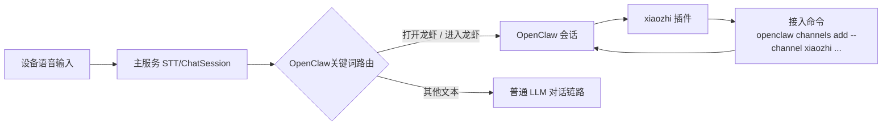

# OpenClaw 接入说明

## 架构图

## 安装步骤

1. 确保 OpenClaw 已正常运行。
2. 在智能体的 `OpenClaw设置` 弹层复制接入命令，系统会自动填入当前服务的 WebSocket URL 和该智能体的 JWT token。
3. 在 OpenClaw 所在环境依次执行以下命令：
   `openclaw plugins install @xiaozhi_openclaw/xiaozhi`
   `openclaw channels add --channel xiaozhi --url ws://<系统地址>/ws/openclaw --token <jwt>`
   `openclaw gateway restart`
4. 查看插件是否安装成功：`openclaw plugins list | grep xiaozhi`

## 使用方法

1. 在智能体的 `OpenClaw设置` 弹层点击“复制命令”。
2. 在 OpenClaw 所在环境执行复制出的三条命令，完成插件安装、channel 配置和网关重启。
3. 安装和配置完成后，即可在 OpenClaw 会话中调用 xiaozhi 插件能力。
4. 在 `查看openclaw` 弹层可使用“发送测试”验证连通性与回复。
5. 在设备侧可通过 `打开龙虾` / `进入龙虾` 进入 OpenClaw 模式，通过 `关闭龙虾` / `退出龙虾` 退出模式。

## 排查建议

- 状态显示未连接：确认 `openclaw channels add` 使用的是最新 URL 和 token，且已执行 `openclaw gateway restart`。
- 对话测试超时：检查插件是否安装成功、channel 命令中的 URL/token 是否正确、OpenClaw 会话是否在线。
